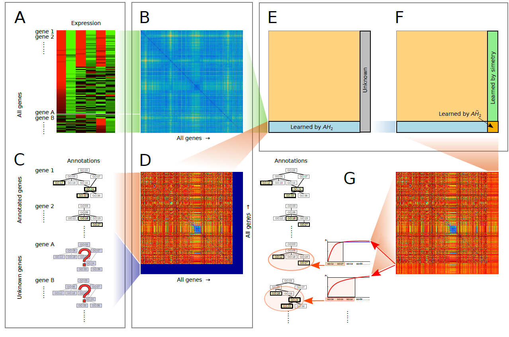

# exp2GO
This repository contains the data and source code for the original methods proposed in:

L. Di Persia, T. Lopez, A. Arce, D.H. Milone, and G. Stegmayer, "*exp2GO: improving prediction of functions in the Gene Ontology with expression data*", 2021.

exp2GO is a novel method for the computational prediction of gene function annotations based on the inference of GO similarities from expression similarities.

**Pipeline of exp2GO for inferring GO labels**

    A) Expression data. 

    B) Expression pairwise distance matrix among all genes in the study. 

    C) Semantic data: GO annotations for well-known genes (gene 1, gene 2,...); some genes in the study are completely unknown (gene A, gene B,...). 

D) Semantic distance matrix among all genes: with missing rows and columns because many genes are not semantically annotated. 

E) and F) exp2GO completes the missing semantic distances, using the information available in B) and D). 

G) Once the semantic distance matrix is completed, GO annotations are assigned according to the reconstructed semantic space. From the closest set of genes with known GO terms, the potential terms (according to a Bayesian model) are sorted in descending order by their posterior probability. Finally, the candidate GO terms with the highest accumulated probability (in yellow) are assigned to each un-annotated gene (gene A, gene B,...).

This repository provides the data and several notebooks to use exp2GO. It is open sourced and free to use. If you use any part of this, please cite our work. 

## Reproducing paper results 

The next notebooks reproduce the results presented in the paper (by default for *Arabidopsis thaliana*):  

1. [Expression data](https://colab.research.google.com/github/sinc-lab/exp2GO/blob/master/notebooks/01_expression_ara_espinoza.ipynb): 
    - convert the original expression files to an unified format
    - remove the empty genes
    - calculate the expression distance matrix (cosine distance by default)
    - other notebooks are provided for [*Dictyostelium discoideum*](https://colab.research.google.com/github/sinc-lab/exp2GO/blob/master/notebooks/01_expression_dicty_zitnik.ipynb) and [*Saccharomyces cerevisiae*](https://colab.research.google.com/github/sinc-lab/exp2GO/blob/master/notebooks/01_expression_yeast_eisen.ipynb)

2. [Annotations](https://colab.research.google.com/github/sinc-lab/exp2GO/blob/master/notebooks/02_annotations.ipynb):
    - extract annotations from GAF (Biological Process by default)
    - only for expressed genes in step 1
    - with experimental annotations

### Leave-one-out (LOO) experiment
3. [Ancestors for LOO experiment](https://colab.research.google.com/github/sinc-lab/exp2GO/blob/master/notebooks/03_loo_ancestors.ipynb):
    - propagate annotations extracted in step 2
    - using CAFA3 reference OBO (2016-06-01)

4. [Semantic distances for LOO experiment](https://colab.research.google.com/github/sinc-lab/exp2GO/blob/master/notebooks/04_loo_semantic_dist_genes.ipynb):
    - calculate pairwise semantic distances
    - provide Resnik, Lin, Relevance (by default)
    - integrated by gene with min (by default), max, average or BMA

5. [exp2GO LOO experiment](https://colab.research.google.com/github/sinc-lab/exp2GO/blob/master/notebooks/exp2go_loo.ipynb)

### Delta-T (CAFA3) experiment
3. [Filter terms for DeltaT experiment](https://colab.research.google.com/github/sinc-lab/exp2GO/blob/master/notebooks/03_deltaT_filter_terms.ipynb):
    - filter terms from the annotations extracted in step 2
    - with less than 3 occurrences
    - and not in the intersection between T-1 and T0

4. [Ancestors for DeltaT experiment](https://colab.research.google.com/github/sinc-lab/exp2GO/blob/master/notebooks/04_deltaT_ancestors.ipynb):
    - propagate annotations extracted in the previous step
    - using CAFA3 reference OBO (2016-06-01)

5. [Semantic distances for DeltaT experiment](https://colab.research.google.com/github/sinc-lab/exp2GO/blob/master/notebooks/05_deltaT_semantic_dist_genes.ipynb):
    - calculate pairwise semantic distances
    - provide Resnik, Lin, Relevance (by default)
    - integrated by gene with min (by default), max, average or BMA

6. [exp2GO DeltaT experiment](https://colab.research.google.com/github/sinc-lab/exp2GO/blob/master/notebooks/exp2go_deltaT.ipynb)

